# SitSense Posture Analytics — Exploratory Data Analysis

## Overview
This project analyzes SitSense's posture and session datasets to uncover patterns in posture behavior, evaluate posture metrics, and generate actionable insights for improving the product experience.

The analysis includes:
- Data cleaning & preprocessing
- Metrics parsing (7 posture metrics)
- Session duration exploration
- Posture classification behavior
- Correlation analysis of metrics
- Visualization & insight generation

---

## Project Structure

---

## Data Cleaning Summary
Key steps performed:
- Combined multiple CSV files
- Trimmed whitespace, normalized IDs
- Converted timestamps to datetime format
- Parsed metrics JSON strings into numeric columns
- Dropped invalid or malformed rows
- Validated session durations
- Joined posture + session datasets on `(user_id, session_id)`

---

## Key Insights Summary

### Posture Label Distribution
- **Good posture:** 70.7%  
- **Fair posture:** 20.7%  
- **Poor posture:** 8.6%  

Users mostly maintain “good” posture, but **“poor” posture sessions show extremely strong metric deviations**.

---

### Session Duration Analysis
- **Mean duration:** 58.1 minutes  
- **Median duration:** 75.6 minutes  
- **99th percentile:** ~85 minutes  
- Long sessions show more posture drift and angle deviations.

---

### Posture Metric Insights (7 Metrics)
**1. CVA Angle (Chin–Vertical Angle)**  
- Strongest indicator of posture  
- Lower CVA = significantly poorer posture  
- Excellent separation between good → fair → poor

**2. Head Forward**  
- Increases sharply in poor posture  
- Strong correlation with neck angle (0.59)

**3. Head Tilt**  
- Mostly near zero  
- Larger positive/negative tilt appears in poor posture

**4. Neck Angle**  
- Increases dramatically in poor posture  
- One of the top predictors for posture label

**5. Neck Turn**  
- Mostly centered on 0°  
- Large rotations appear in poor posture only

**6. Shoulder Slope**  
- Very strong increase in poor posture cases  
- Correlates with trunk angle (0.55)

**7. Trunk Angle**  
- Sharp rise in poor posture  
- Indicates full upper-body lean, not just head movement

---

## Metric Correlation Analysis

### Correlation Heatmap
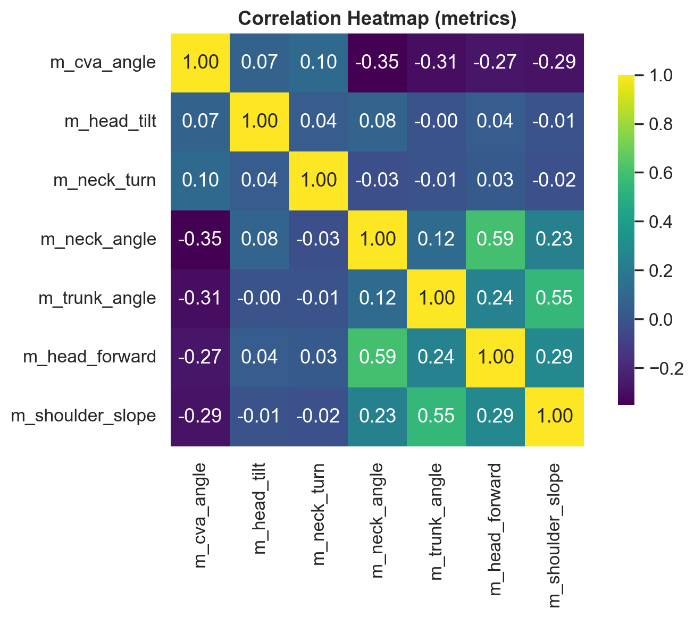

The posture dataset includes seven key angular metrics extracted from SitSense’s posture-tracking pipeline. The correlation matrix reveals how these biomechanical measurements interact with one another and jointly define posture quality (Good, Fair, Poor). Understanding these relationships is essential for:

- Building robust posture scoring rules  
- Identifying redundant metrics  
- Improving model features for ML posture classification  
- Detecting compensatory movements (e.g., neck angle ↑ when head forward ↑)

Below is an in-depth interpretation of the correlations and what they imply about real posture behavior.

### 1. The Strongest Positive Correlations

#### **m_head_forward ↔ m_neck_angle (0.59)**  
This is the most meaningful relationship in the dataset.  
As a user’s head moves forward (greater forward drift), the neck angle increases sharply.  
This aligns perfectly with real biomechanics:

- When the chin moves forward → the cervical spine must flex → neck angle increases.  
- Poor posture amplifies this coupling dramatically.

➡ **Interpretation:**  
These two together measure the classic “tech-neck / forward-head posture,” a major posture risk indicator.

---

#### **m_shoulder_slope ↔ m_trunk_angle (0.55)**  
When the shoulders slope downward (slouching), the trunk angle also increases.  
This reflects upper-body collapse into forward flexion.

➡ **Interpretation:**  
This pair captures full-torso slouch rather than neck-only posture.  
It is highly relevant for long-session fatigue detection.

---

#### **m_neck_angle ↔ m_shoulder_slope (0.23)**  
Slouching shoulders often induce compensatory neck lift or tilt.

➡ **Interpretation:**  
This indicates multi-segment “chain reactions” during poor posture —  
when one part deteriorates, adjacent segments adjust unnaturally.

---

### 2. Negative Correlations with CVA (Chin–Vertical Angle)

CVA is the *strongest overall posture quality indicator*.  
Higher CVA = upright head.  
Lower CVA = forward head posture.

CVA correlates negatively with:

- **m_neck_angle (-0.35)**
- **m_trunk_angle (-0.31)**
- **m_head_forward (-0.27)**
- **m_shoulder_slope (-0.29)**

➡ **Interpretation:**  
As posture worsens, CVA sharply decreases while all other angles rise.  
This validates CVA as a reliable anchor feature for scoring overall posture.

This also proves that:

 **Good posture = high CVA + low angles across the board**  
 **Poor posture = low CVA + spikes in neck, head, trunk, shoulder metrics**

---

### 3. Low or Near-Zero Correlations

Metrics such as:

- **m_head_tilt**
- **m_neck_turn**

show very low correlations with the core slouch metrics.

➡ **Interpretation:**  
These represent **lateral** motion rather than **forward/backward** posture.  
They are useful for detecting:

- head tilt habits,  
- asymmetry,  
- side-leaning behavior,  

but do not directly correspond with forward-slouch patterns.

They are complementary — not redundant.

---

### 4. Multi-Metric Posture Signatures

The correlation structure reveals THREE major posture behavior clusters:

#### **Cluster A — Forward-Head Posture Dominance**
- CVA (negative)
- Head forward
- Neck angle  

This cluster defines **tech-neck posture**, the most common poor posture form.

---

#### **Cluster B — Full-Torso Slouch**
- Trunk angle  
- Shoulder slope  
- Neck angle (secondary)  

This cluster indicates **fatigue-driven collapse** seen in long sessions (75+ minutes).

---

#### **Cluster C — Lateral Movements**
- Head tilt  
- Neck turn  

Independent of posture quality but useful for ergonomic asymmetry and balance.

---

### 5. Implications for SitSense Product Development

- **CVA should be central to posture scoring.**  
  It provides the cleanest separation across posture labels and aligns with ergonomics research.

- **Neck Angle + Head Forward = top predictors for poor posture.**  
  These two should trigger early posture warnings.

- **Shoulder Slope + Trunk Angle detect prolonged-session slouching.**  
  Useful for session-based posture fatigue indicators.

- **Low-correlation metrics add dimensionality.**  
  Tilt/turn can detect habitual asymmetries or workspace layout problems.

- **Feature redundancy is low.**  
  All seven metrics provide unique information — beneficial for future ML models.

---

### 6. Recommendation for ML Feature Engineering

- Combine **CVA + Neck Angle + Head Forward** as a composite “Forward Posture Index.”
- Use **Shoulder Slope + Trunk Angle** for “Torso Collapse Index.”
- Keep tilt/turn as secondary features for classifying posture subtypes.

This will dramatically stabilize classification accuracy and interpretability.

## Product Recommendations
Based on the analysis:
- Prioritize **CVA, head-forward, neck angle, shoulder slope** for posture scoring
- Implement *threshold-based alerts* for sharp metric spikes
- Personalize posture scoring per user baseline
- Smooth metrics over time to reduce noise
- Build a simple ML classifier to automate posture classification

---

## Visual Gallery

### Posture Distribution
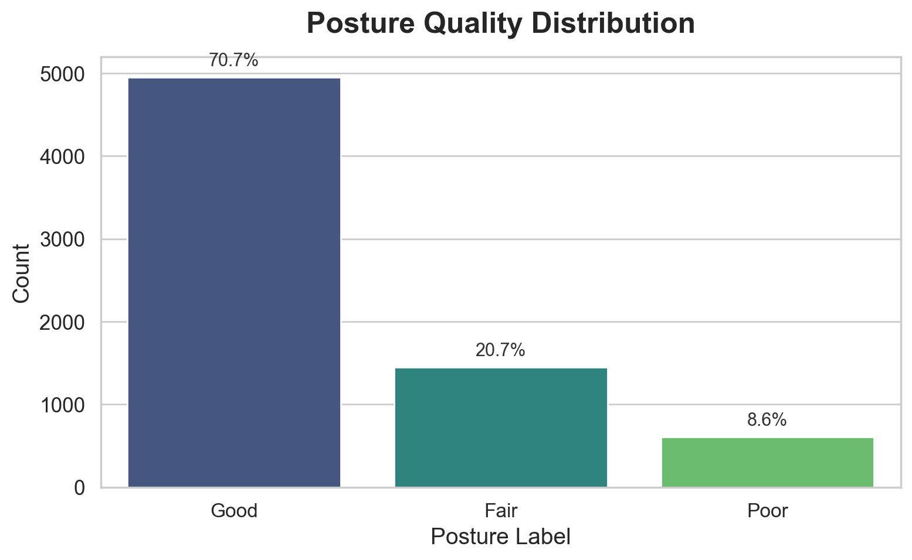

### Session Duration Distribution
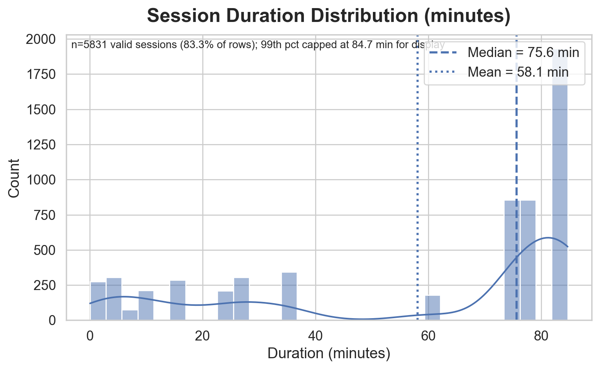

### Example Metric Distributions
### m_cva_angle
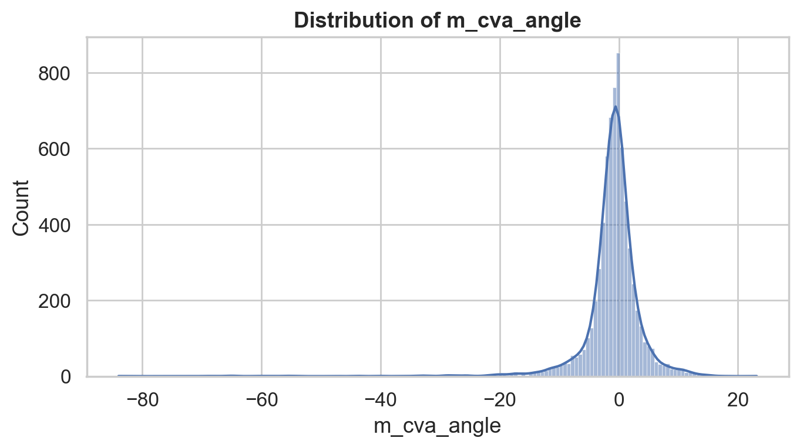

### m_head_forward
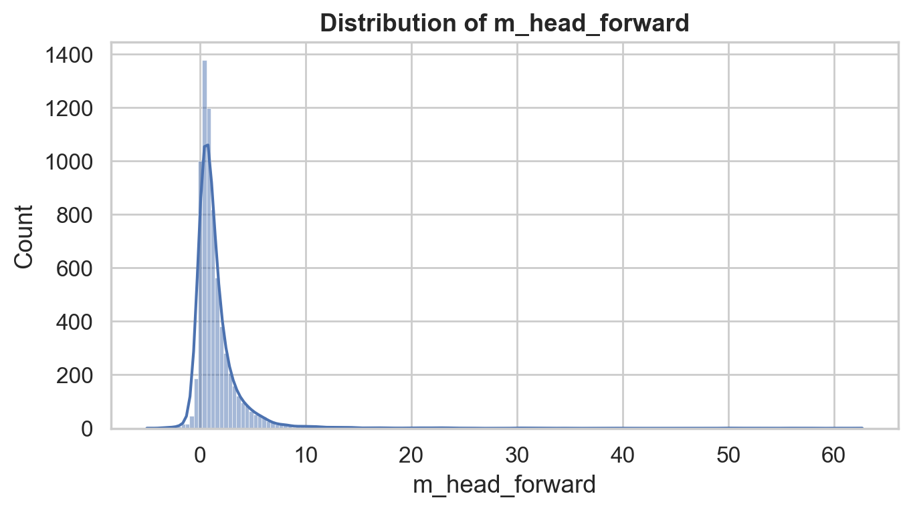

### m_head_tilt
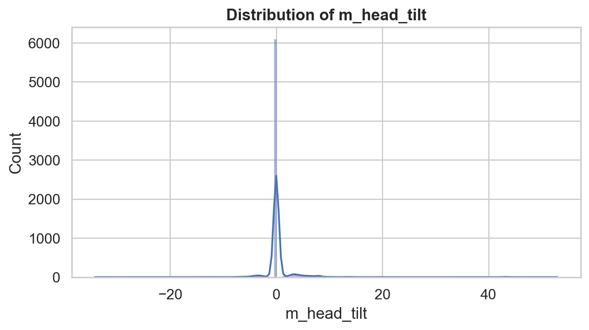

### m_neck_angle
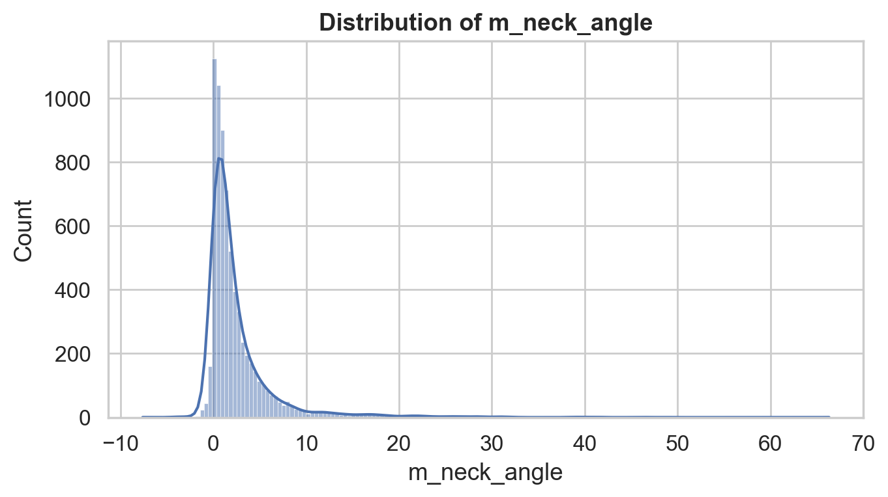

### m_neck_turn
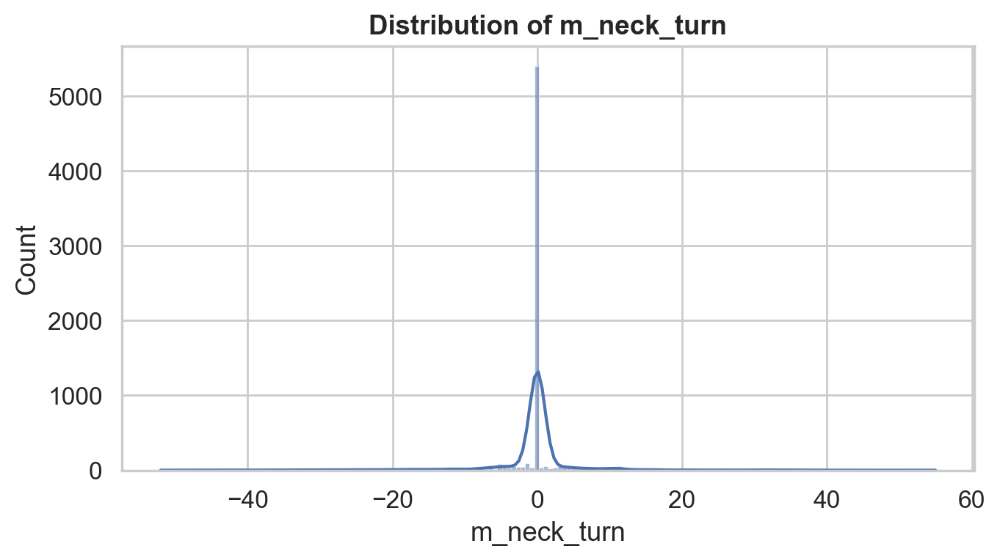

### m_shoulder_slope
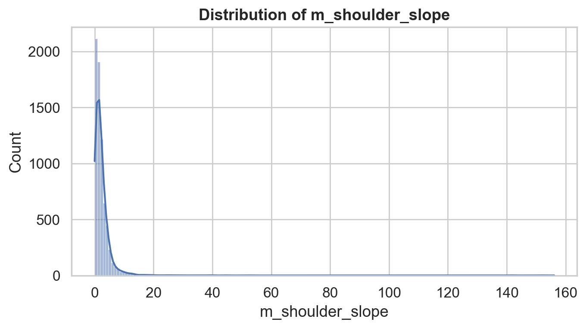

### m_trunk_angle
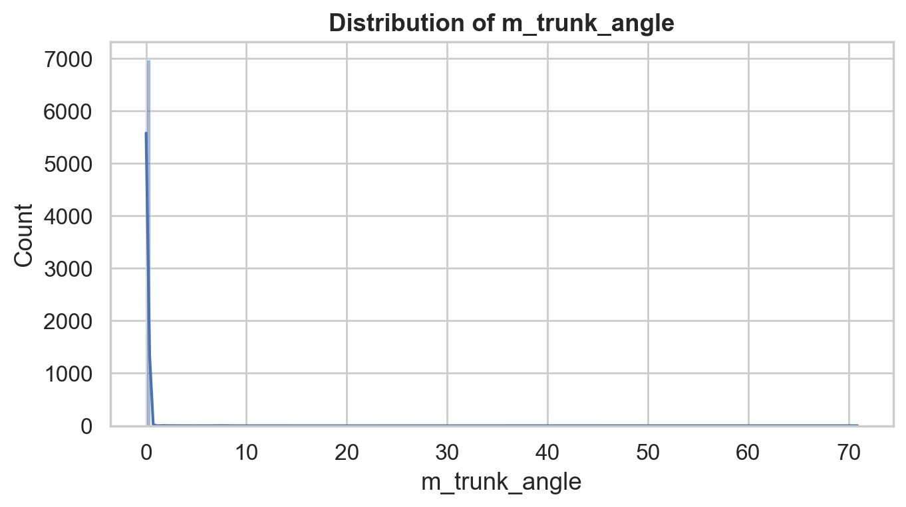

## 📉 Metric Distributions by Posture

### m_cva_angle by Posture
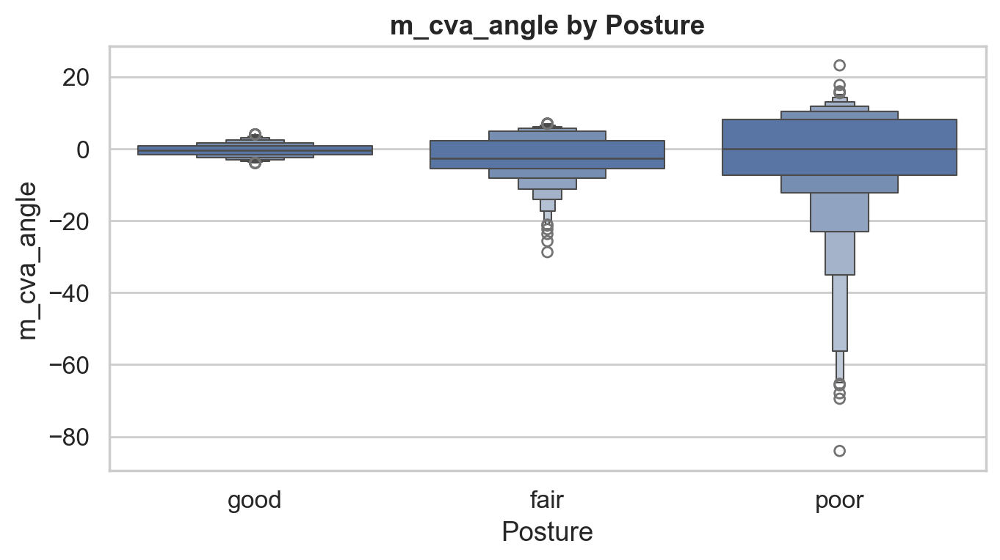

### m_head_forward by Posture
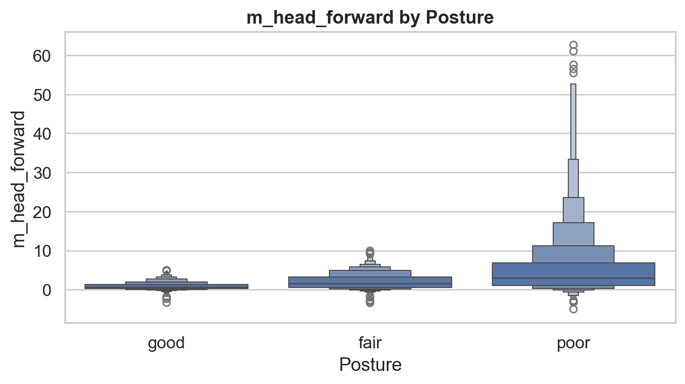

### m_head_tilt by Posture
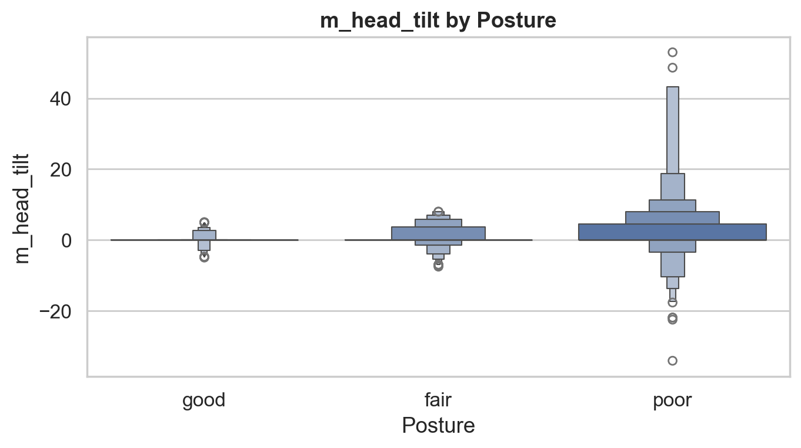

### m_neck_angle by Posture
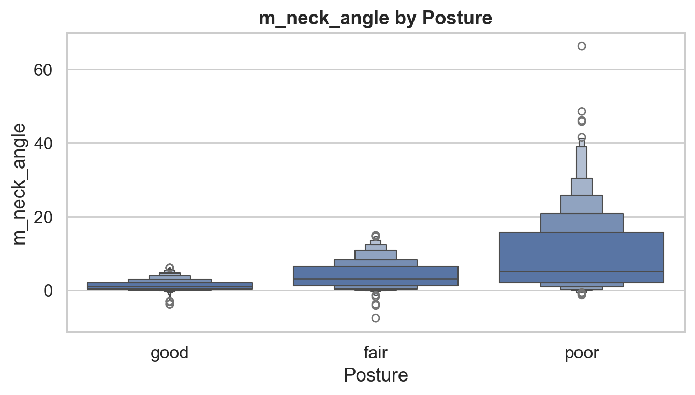

### m_neck_turn by Posture
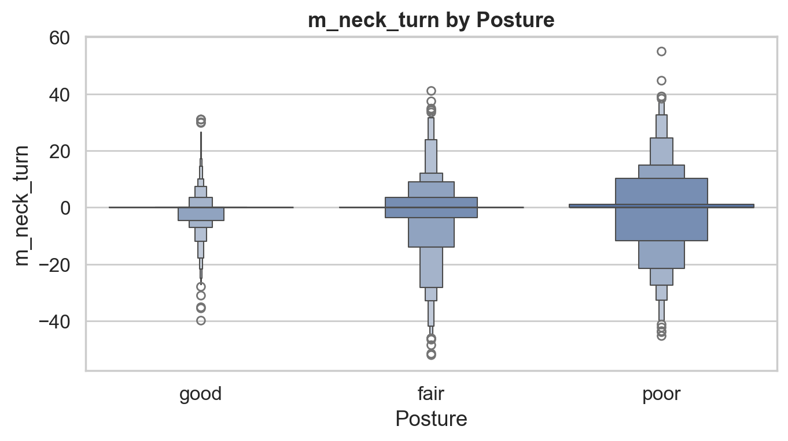

### m_shoulder_slope by Posture
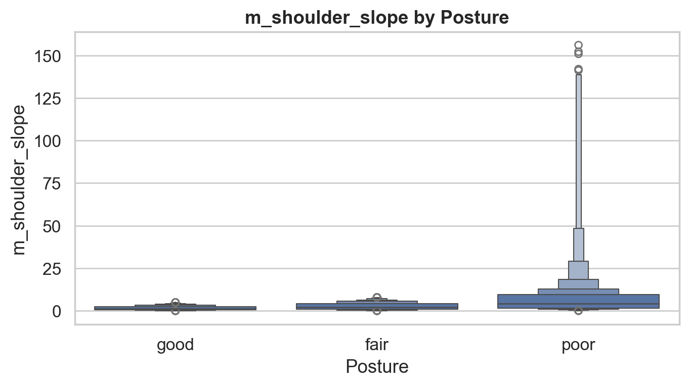

### m_trunk_angle by Posture
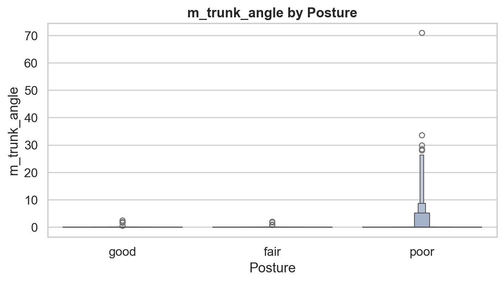
### metrics correlation heatmap
[Correlation Heatmap](plots/metrics_correlation_heatmap.png)
---
## Next Steps
- Build a posture classification model (Good/Fair/Poor)
- Add time-series smoothing
- Explore user-level posture trends
- Build a Streamlit dashboard for real-time insights

---

##  Author
**Niranjan Shankar**  
UC Davis — Mathematics & Statistics
Aspiring Data Scientist | Actuarial Analyst | ML Enthusiast  
LinkedIn: www.linkedin.com/in/neo2604  
GitHub: https://github.com/StrangeStorm243-bit

